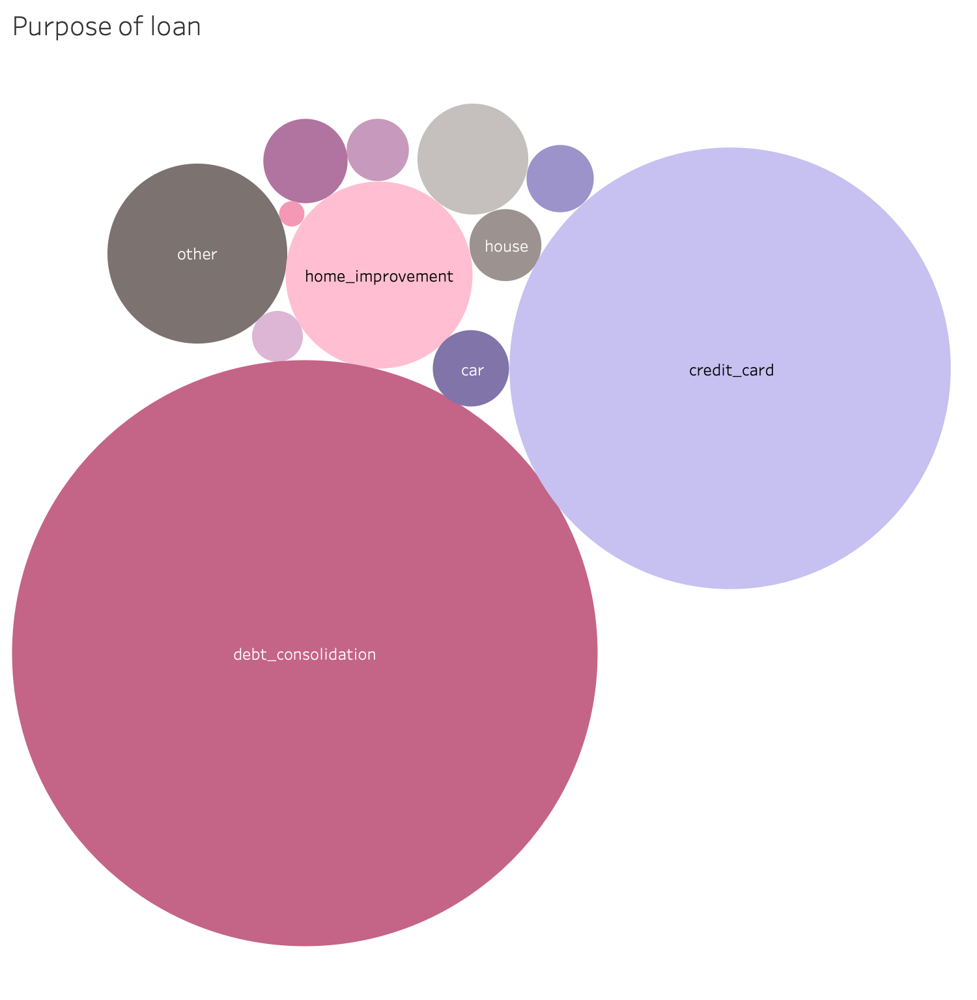
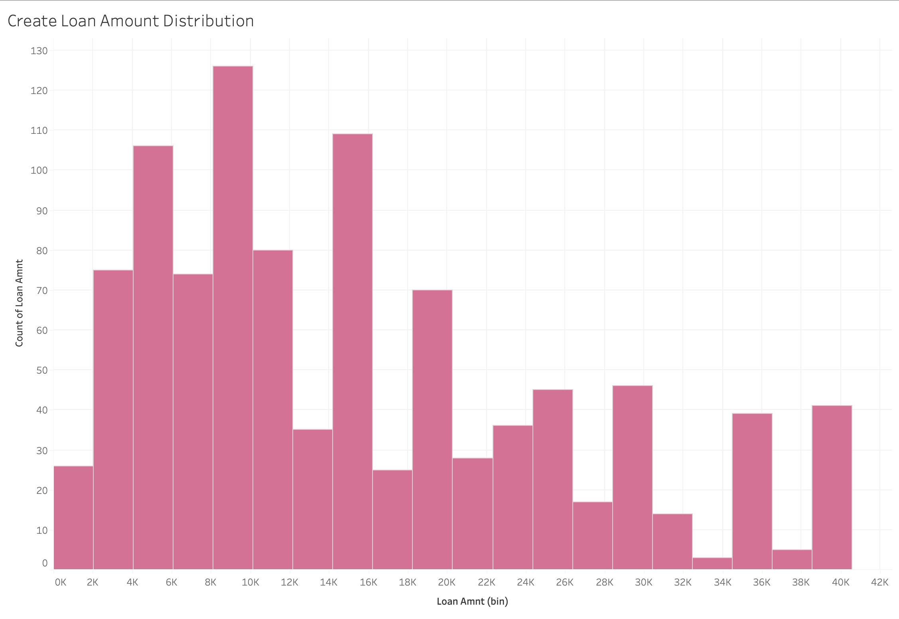
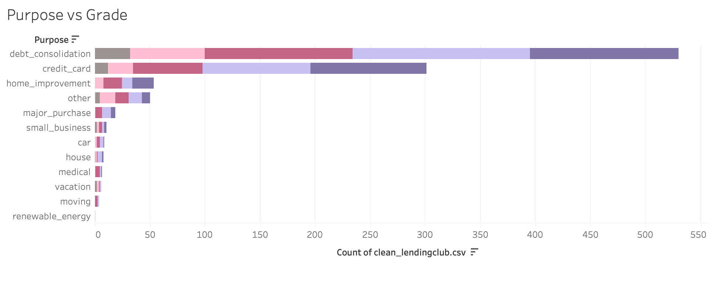
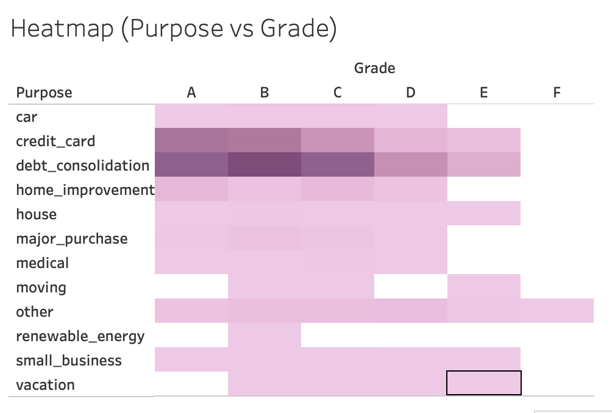
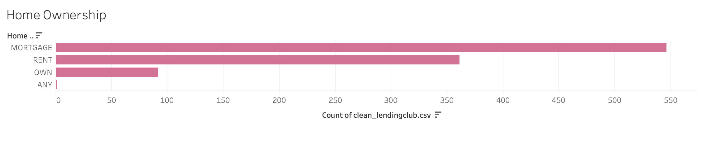
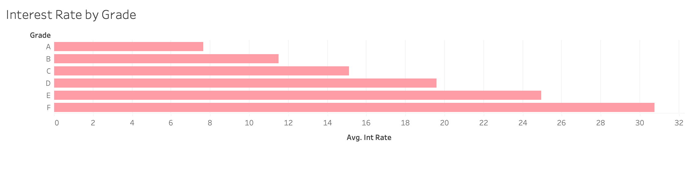
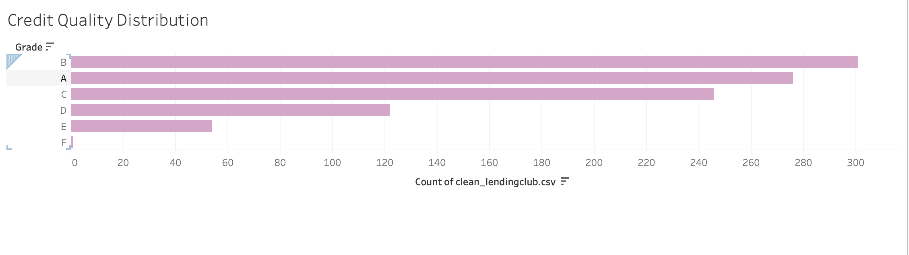

# Default Risk Analysis and Portfolio Optimization  
## LendingClub Loan Data

**Sector:** Finance (Consumer Lending)

### Team Members
- Gnana Priyanka  
- Divyanjali Gopisetty  
- Giddalur Jaya Geethika  
- Spruha Perumalla  
- Khyati Kapil  

**Institute:** Newton School Of Technology  
**Date:** April 2026  

---

## Executive Summary

The objective of this project is to analyze loan-level data from LendingClub to identify key drivers of loan default risk and recommend actionable strategies to improve underwriting decisions and portfolio performance.

Using a dataset of over 2.2 million loan records, we implemented a Python-based ETL pipeline to clean, transform, and structure the data. Exploratory Data Analysis (EDA) and logistic regression modeling were used to uncover patterns and quantify risk factors.

Key findings indicate that variables such as loan grade, term length, debt-to-income ratio (DTI), and loan purpose significantly influence default probability. The logistic regression model achieved a ROC-AUC score of **0.68**, indicating moderate predictive performance.

Based on these insights, we propose tightening underwriting policies, introducing DTI thresholds, and optimizing portfolio allocation to reduce default risk while maintaining revenue.

---

## Sector Context and Problem Statement

### Sector Context
Consumer lending platforms operate in a highly competitive and risk-sensitive environment. Accurate credit risk assessment is essential to ensure profitability and minimize loan defaults.

### Problem Statement
The goal of this project is to identify key drivers of loan default risk and recommend strategies to reduce expected defaults while maintaining revenue.

---

## Data Description

- **Source:** LendingClub Dataset (Kaggle)  
- **Number of Records:** 2,260,668  
- **Format:** CSV  
- **Target Variable:** `is_default`  

### Key Features
- Loan Amount  
- Interest Rate  
- Term  
- Grade and Sub-grade  
- Debt-to-Income Ratio (DTI)  
- Annual Income  
- Purpose  
- Verification Status  
- State  
- Issue Date  

---

## Data Cleaning and ETL Methodology

- Standardized column names  
- Parsed date fields  
- Feature engineering  
- Data cleaning  
- Created target variable  

---

## KPI and Metric Framework

- Default Rate  
- Exposure Proxy  
- Average Interest Rate  

---

## Exploratory Data Analysis

### Loan Purpose Distribution


### Loan Amount Distribution


### Purpose Distribution


### Purpose vs Grade


### Heatmap (Purpose vs Grade)


### Home Ownership


### Interest Rate by Grade


### Credit Quality Distribution


---

## Statistical Analysis

**Model Used:** Logistic Regression  

- **ROC-AUC Score:** 0.68  

### Key Drivers
- Loan Grade  
- Term  
- DTI  
- Interest Rate  

---

## Dashboard


---

## Key Insights

1. Default risk increases with lower grades  
2. High DTI increases risk  
3. Loan purpose impacts defaults  
4. Portfolio concentration risk exists  

---

## Business Recommendations

1. Tighten underwriting policies  
2. Introduce DTI thresholds  
3. Optimize portfolio mix  

---

## Project Structure
```
project/
│── data/
│── notebooks/
│── images/
│── src/
│── README.md
```

---

## Tech Stack

- Python (Pandas, NumPy, Scikit-learn)  
- Tableau (Dashboard)  
- Jupyter Notebook  

---

## How to Run

1. Clone the repository  
2. Install dependencies:
   ```bash
   pip install -r requirements.txt
3. Run notebooks for EDA and modeling
4. Open Tableau dashboard for visualization

## Conclusion

This project demonstrates how data-driven insights can significantly improve credit risk assessment and portfolio management in consumer lending.


